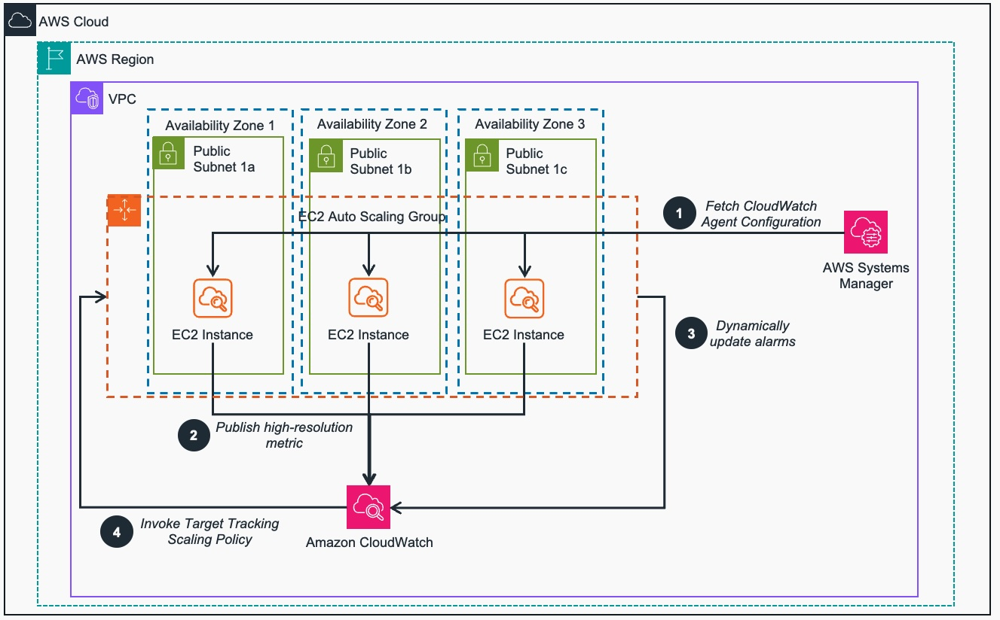
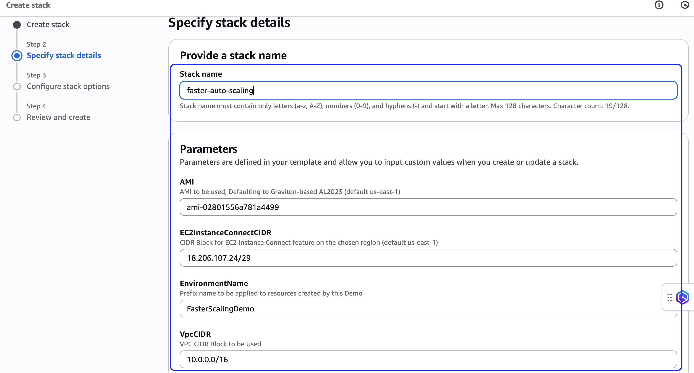
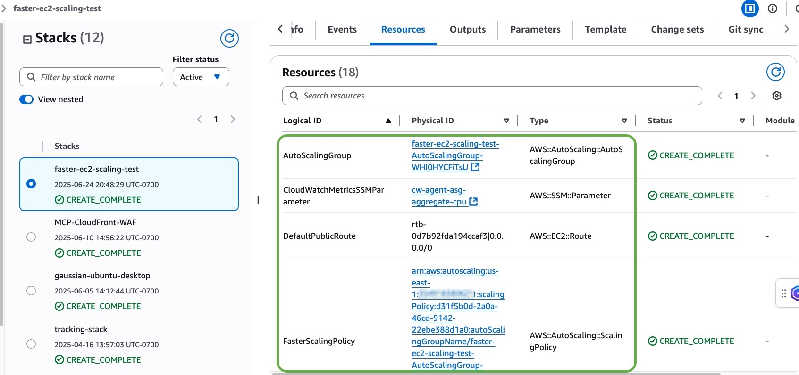
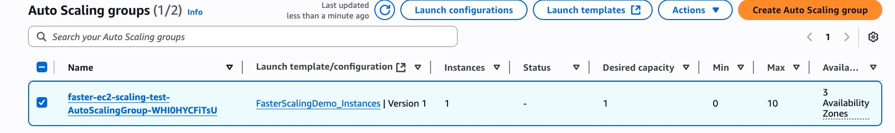
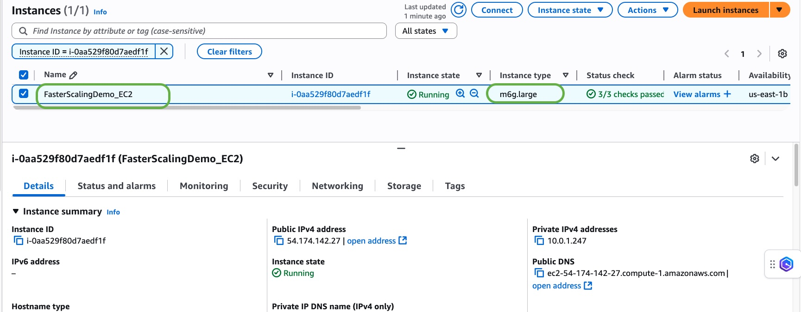
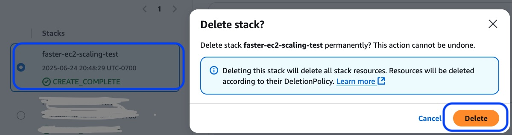

# Guidance for AutoScaling Groups - Faster Scaling on AWS

## Table of Contents

1. [Overview](#overview)
    - [Cost](#cost)
2. [Prerequisites](#prerequisites)
3. [Deployment Steps](#deployment-steps)
4. [Deployment Validation](#deployment-validation)
5. [Next Steps](#next-steps)
6. [Cleanup](#cleanup)
7. [FAQ, known issues, additional considerations, and limitations](#faq-known-issues-additional-considerations-and-limitations)
8. [Notices](#notices)
9. [Authors](#authors)

## Overview
To enable the fastest response from Target Tracking policies, users can track metrics published at sub-minute granularity to Amazon CloudWatch (also known as "high-resolution CloudWatch metrics"). 
Users can update an existing Target Tracking policy or create a new one with a high-resolution metric as part of a CustomizedMetricSpecification. This enables faster reaction time for higher availability, and can sometimes lower total cost as well.

**Architecture Diagram:**

*Figure 1 - Reference Architecture of the guidance deployed within a VPC*

**Architecture Steps:**

1. During its bootstrap process, Elastic Compute Cloud (EC2) instances fetch a pre-created Unified AWS CloudWatch Agent (CWAgent) configuration from AWS Systems Manager (SSM).
2. The CWAgent running on the EC2 instances publish the chosen metric with a period of 10 (more responsive scaling), 30 or 60 (default) seconds to Amazon CloudWatch (CW).
3. The EC2 Auto Scaling Group (ASG) monitors the group’s scaling activities and automatically tunes the CW Alarms used to invoke the ASG’s Target Tracking’s scaling policies
 to optimize between cost and performance
4. CloudWatch Alarms invoke the ASG’s Target Tracking scaling policies to dynamically scale the group’s number of EC2 instances.

### Cost 
_You are responsible for the cost of the AWS services used while running this Guidance. As of June 2025, the cost for running this Guidance with the default settings in the US East (N. Virginia) region is approximately $194.95 per month for with workday processing spike scaling or aproximately $59.94 per month with no scaling._

* Two High resolution CloudWatch alarms are created (compared with 2 standard resolution alarms with default target tracking).
* One Custom metric in CloudWatch is created.
* The CloudWatch Agent sends API calls per instance at a 10 second interval, which are billed per API call according to the [CloudWatch pricing in the region being used](https://aws.amazon.com/cloudwatch/pricing/).
* Costs can be offset by setting a more aggressive target value, if fewer buffer instances are needed to absorb load spikes.  See blog link below for a detailed example showing an 8% net monthly savings.

_We recommend creating a [Budget](https://docs.aws.amazon.com/cost-management/latest/userguide/budgets-managing-costs.html) through [AWS Cost Explorer](https://aws.amazon.com/aws-cost-management/aws-cost-explorer/) to help manage costs. Prices are subject to change. For full details, refer to the pricing webpage for each AWS service used in this Guidance._

#### Sample Cost Table 
The following table provides a sample cost breakdown for deploying this Guidance with the default parameters in the US East (N. Virginia) Region `us-east-1` for one month.

| AWS service  | Dimensions | Cost [USD] |
| ------------------------- | ------------------------- | ------------ |
| Amazon CloudWatch Alarms  | 2 High-Resolution Alarms  | $ 0.60 |
| Amazon CloudWatch Metrics | 1 Custom Metric  | $ 0.30 |
| Amazon CloudWatch Metrics | ˜2.592m PutMetricData API Calls  | $ 25.92 |
| Amazon EC2 | 1-10 m6g.large(s) with workday spike  | $ 168.13 |
| **Total** | | **$ 194.95/mo**|

## Prerequisites

There are no particular prerequisites into deploying this guidance, other than an user with sufficient permissions to deploy the CloudFormation template. The guidance is self-sufficient and does not alter any existing resources.

### Supported Regions

The services discussed and used in this guidance are available in all AWS regions.

## Deployment Steps

### Pre-Deployment Considerations
The CloudFormation Template used in this solution was made to be self-suficient, deploying resources on their own environment on in the us-east-1 (North  Virginia) region. If you want to deploy on a different region, or adapt to your environment, read through the following guidance:

* Make sure to adapt the CloudFormation Parameters details accordingly:
    * `AMI`: Use the corresponding AMI for the region (this guidance solution is using Amazon Linux 2023 for Amazon Graviton)
    * `EC2InstanceConnectCIDR`: Use the corresponding EC2 Instance Connect CIDR for the [region](https://docs.aws.amazon.com/AWSEC2/latest/UserGuide/ec2-instance-connect-prerequisites.html#ec2-instance-connect-setup-security-group).

### Deploying
1. Navigate to the [Cloud Formation Console](https://us-east-1.console.aws.amazon.com/cloudformation/) in the us-east-1 (N. Virginia) region.
2. Click the Create Stack button and select "With existing resources (import resources)" and follow the steps to upload the the `FasterScalingCFN.yml` template.
3. When specifying Stack details, give the stack a name such as `FasterScalingDemo` and adapt any entries as needed.
4. Be sure to perform this operation with an IAM User that has permissions 

*Figure 2 - Guidance CloudFormation Stack input parametes*

## Deployment Validation
* Open CloudFormation console and verify the status of the template with the name starting with `FasterScalingDemo`.
* If deployment is successful, you should see an EC2 Auto Scaling Group with the name starting with `FasterScalingTest-AutoScalingGroup` in the EC2 console for the region.

*Figure 3 - Guidance CloudFormation Stack Successfully Deployed*

*Figure 4 - The EC2 AutoScaling Group created by the stack*

*Figure 5 - A successfully launched by auto-scaling EC2 Instance*

## Next Steps
Consider if any of the following adaptations need to be made to the Cloid Formation template before using in your environment:

* Update the launch template for your use case/application (e.g. using your custom AMI, or adapting the UserData script to install different software).
* Add a Load Balancer to the ASG.
* Use a different metric that's meaningful to your application. Keeping in mind the considerations for [metrics that work with Target Tracking](https://docs.aws.amazon.com/autoscaling/ec2/userguide/as-scaling-target-tracking.html#target-tracking-considerations).
* Adapt the IAM Role's permissions and Security Group rules according to your organization's requirements.

## Cleanup
1. Navigate to the [Cloud Formation Console](https://us-east-1.console.aws.amazon.com/cloudformation/) in the us-east-1 (N. Virginia) region.
2. Select the Stack you deployed on the previous section, hit the "Delete" button and confirm your intent to delete it:

*Figure 6 - Deleting the AutoScaling Group CloudFormation stack*

## FAQ, known issues, additional considerations, and limitations

**Additional considerations**
* This sample deploys resources in a public subnet with public IP addresses to allow them to update packages from online repositories. They are not accessible externally by default. If you need to connect to the instances make sure to use [EC2 Instance Connect](https://docs.aws.amazon.com/AWSEC2/latest/UserGuide/ec2-instance-connect-methods.html#ec2-instance-connect-connecting-console).
* For more information, see [Faster Scaling with EC2 Auto Scaling](https://aws.amazon.com/blogs/compute/faster-scaling-with-amazon-ec2-auto-scaling-target-tracking/).

## Notices
*Customers are responsible for making their own independent assessment of the information in this Guidance. This Guidance: (a) is for informational purposes only, (b) represents AWS current product offerings and practices, which are subject to change without notice, and (c) does not create any commitments or assurances from AWS and its affiliates, suppliers or licensors. AWS products or services are provided “as is” without warranties, representations, or conditions of any kind, whether express or implied. AWS responsibilities and liabilities to its customers are controlled by AWS agreements, and this Guidance is not part of, nor does it modify, any agreement between AWS and its customers.*

## Authors
* Tiago Souza, Solutions Architect
* Shahad Choudhury, Sr. Cloud Support Engineer
* Daniel Zilberman, Sr. Solutions Architect, Technical Solutions
